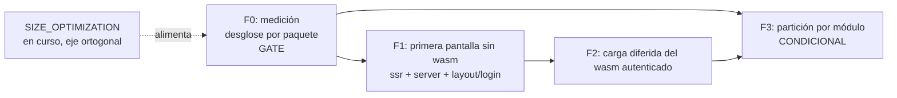

# MASTER PLAN — Carga por etapas del cliente: la primera petición sin WASM

> **Status:** EN CURSO · consolidado 2026-09-13 · La pantalla previa al login se sirve como HTML+CSS sin wasm; el binario se carga recién cuando hay sesión. Mecánica en el framework, cero boilerplate para las apps.
> Doctrina: [`api-design` skill](https://github.com/webtyp/devskills/blob/main/skills/api-design/SKILL.md) · Índice: [`MASTER_PLANS.md`](MASTER_PLANS.md)

Orquestador multi-repo. Cada librería afectada lleva su propio `docs/PLAN.md`
autocontenido; este archivo solo fija decisiones, grafo de dependencias,
gates y estado por fase.

## 1. El problema, con números reales

Medido hoy en `veltylabs/mjosefa-cms` (TinyGo, modo S):

| | Tamaño |
|---|---|
| `web/public/client.wasm` | **486 KB** |
| El mismo, gzip (lo que viaja) | **162 KB** |

Eso se descarga **en la primera petición, antes de que nadie se haya
autenticado** — para pintar una tarjeta con dos campos y un botón.

Y va a empeorar por razones legítimas: faltan módulos por incorporar, y
`webtyp/pdf` sumará del orden de **200 KB** cuando se generen PDF desde el
cliente. El objetivo del dueño para la primera carga es **~50 KB gzip**, que
no se alcanza optimizando el binario: se alcanza **no mandándolo**.

## 2. La decisión de fondo

> **La primera pantalla no necesita wasm, y por lo tanto no debe traerlo.**

No es una aspiración, es una observación sobre lo que esa pantalla ya es hoy:

- **Ya se renderiza en el servidor.** `webtyp/layout/login` implementa
  `RenderHTML()`; el formulario sale de `webtyp/form` por SSR.
- **Ya no tiene validación de cliente, a propósito.** En el login LAN se
  desactiva (`SetSkipValidation`) para no delatar qué tipo de credencial se
  pide; quien valida es el servidor. O sea: **no hay lógica que portar**.
- **El envío puede ser un `<form method="POST">` nativo** contra
  `auth.PathLoginRUT`, que ya responde `302` con la cookie de sesión — el
  contrato HTTP que el servidor expone hoy ya es el de un formulario clásico.
- **El límite de autenticación ya es un límite de recarga.** Tanto el alta
  como el login terminan en `location.reload()`. No hay estado de cliente que
  preservar a través de la frontera, así que dividir ahí no cuesta máquinaria
  nueva de transferencia de estado.

Con eso, la primera carga queda en **0 KB de wasm** y el objetivo de 50 KB se
cumple por construcción, no por optimización.

## 3. Lo que este plan NO hace (y por qué)

- **No crea dos binarios mantenidos a mano** (`login.wasm` + `spa.wasm`). El
  costo real de partir en dos no es escribir el código dos veces —ambos
  compilarían de los mismos paquetes Go— sino que **el runtime y las piezas
  compartidas viajan dos veces** para quien sí se autentica, más dos ciclos
  de build y dos cachés que invalidar. Solo se considera si la Fase 0 lo
  justifica con números (Fase 3, condicional).
- **No reescribe validación en JavaScript.** Sería romper el DRY que este
  plan existe para proteger. Como la validación previa al login ya es
  server-side, no hay nada que reescribir.
- **No pisa [`SIZE_OPTIMIZATION_MASTER_PLAN.md`](SIZE_OPTIMIZATION_MASTER_PLAN.md)**,
  que está en curso y ataca un eje **ortogonal**: que el binario no arrastre
  lo que no le corresponde (rendering/stdlib filtrándose a código agnóstico).
  Ese plan hace el binario más chico; este decide **cuándo se descarga**. Los
  dos suman para la meta de 50 KB, ninguno reemplaza al otro. Si en la Fase 0
  aparece una fuga de las que ese plan persigue, **se reporta allá, no se
  arregla acá**.

## 4. Requisito no negociable: esto vive en el framework

Pedido explícito del dueño: **una app no debe escribir boilerplate para
obtener esto**. `mjosefa-cms` no debe declarar nada, o a lo sumo una línea en
su composición. El reparto:

- El servidor **ya sabe** si la petición trae sesión válida (`Config.Authn`),
  así que la decisión "esta petición es previa al login" es suya y de nadie
  más.
- La página previa al login se sirve **sin la etiqueta `<script>` del wasm**;
  la autenticada sí la lleva.
- El interruptor de revelar la clave (`widget.PartReveal`) es lo único
  interactivo de esa pantalla: se resuelve con el `js.go` del skin
  (`webtyp/components/fieldset`), que es la ranura que el ecosistema ya
  tiene para JS de componente. Es presentación, no lógica de negocio: no
  duplica nada.

## 5. Fases y grafo



| Fase | Repos | Entrega | Gate | Estado |
|---|---|---|---|---|
| **F0** | — (medición, sin cambios de código) | Desglose reproducible de los 486 KB por paquete. | **sí** | ✅ **HECHA** 2026-09-12 — ver §6 |
| **F1a** | `webtyp/form`, `webtyp/server`, app | La pantalla previa se sirve pre-renderizada y **el formulario funciona sin wasm**. | **sí** | ✅ **HECHA** 2026-09-12 — `form.SetAction` (nuevo), `httpd.Context.Decode` acepta `x-www-form-urlencoded` (server v0.2.57), y la app la renderiza desde `config/html.go`. Verificado extremo a extremo: el envío nativo pasó de `400` a `302` con `Set-Cookie`. **No entrega el objetivo §7.1** — ver §8. |
| **F1b** | `webtyp/sitec` | Páginas estáticas y shell conviven en un proyecto; solo el shell lleva el bootstrap; el shell se monta en una ruta **fija del framework** (`/app/`), que la app no elige. | — | ✅ **HECHA** 2026-09-12 — `sitec.ShellPath` + la bifurcación de `RouteExtractedAssets` (`emit_core.go:378-392`). En local, **sin tag**. |
| **F1c** | `veltylabs/mjosefa-cms`, `webtyp/auth`, `webtyp/server`, `webtyp/app` | **Dejar de mandar el wasm antes del login.** Es lo que cierra F1: ver §8. | **sí** | ✅ **HECHA** 2026-09-13 — verificada extremo a extremo, §8.3. En local, pendiente de publicar. |
| **F2** | `webtyp/ssr`, `webtyp/server` | La página autenticada carga el wasm sin bloquear la primera pintura. | no | ☐ pendiente |
| **F3** | — | Partición por módulo. | — | ❌ **DESCARTADA** por F0: los módulos son el 6,7 % del binario (§6). La carga bajo demanda de `webtyp/pdf` pasa a F2. |
| **D** | `veltylabs/mjosefa-cms` | Consumidor de verificación. Idealmente **cero líneas**; si necesita más de una, F1 está mal diseñada. | — | ☐ junto con F1c |

## 6. Resultado de la Fase 0 — MEDIDO, 2026-09-12

Medición reproducible sobre `veltylabs/mjosefa-cms`, con los flags reales de
producción (`tinygo build -target wasm -opt=z -no-debug -panic=trap`, modo S
de `webtyp/app`). El binario enviado pesa **486.402 bytes** (161.941 gzip).
La atribución por paquete se obtiene repitiendo la compilación **con**
símbolos (`-size=full` sin `-no-debug`; `-no-debug` borra justo la
información que mapea código a paquete y reporta todo como `(unknown)`).
Sobre 314.107 bytes de código atribuidos:

| Grupo | Código | Peso |
|---|---|---|
| Maquinaria SPA del framework (`dom` 49.3 KB, `fmt` 27.4, `form` 21.6, `crudview` 16.1, `json` 14.6, `input` 11.6, `view` 10.8, `platformd` 9.0, `fetch` 8.5, `components/*` 22.7, `model` 5.3, `mcp` 4.6, `rightpanel` 2.7, `auth` 2.4, resto) | ~213 KB | **~68 %** |
| Runtime Go/TinyGo + stdlib (`Go interface method` 25.0, `runtime` 13.3, `reflectlite` 8.7, `syscall/js` 7.2, `(unknown)` 11.0, resto) | ~72 KB | **~23 %** |
| **Los cuatro módulos de dominio** (`item_catalog` 8.3, `clinical_encounter` 5.2, `device_manager` 3.4, `staff_manager` 2.3, + envoltorios de la app 1.9) | **~21 KB** | **~6,7 %** |

Piso del runtime, medido aparte con un `main` mínimo (solo `syscall/js`) y los
mismos flags: **22.582 bytes / 9.644 gzip**.

Las tres preguntas del gate quedan respondidas:

1. **¿Chasis o módulos?** Los cuatro módulos de dominio son el **6,7 %** del
   binario. Partir por módulo recuperaría, en el mejor caso imaginable, unos
   20 KB sin comprimir de 486 — y solo para quien no abra esos módulos.
   **F3 queda descartada por los números**, no por criterio.
2. **¿Y `webtyp/pdf`?** Sus ~200 KB no cambian esa conclusión: son un
   argumento para cargarlo **bajo demanda al generar un PDF**, que es un
   problema de carga diferida (F2), no de partir el binario por módulo.
3. **¿El piso del runtime?** 9,6 KB gzip. Ese es el costo que un esquema de
   dos binarios duplicaría: contra un presupuesto de 50 KB gzip es ~20 %
   gastado en nada. Viable en abstracto, inútil dado (1).

**Consecuencia para el plan:** el peso está en la maquinaria SPA
(`dom` + `form` + `crudview` + `input` + `json` + `components`), que es
exactamente lo que la pantalla previa al login **no usa**. Confirma que **F1
es todo el premio**: no mandar nada de eso antes de la sesión. Dato que lo
redondea: `webtyp/layout/login` pesa **1.309 bytes** de código — la pantalla
de login no es el problema; el problema es la maquinaria que hoy viaja con
ella.

`fmt` (27,4 KB) y `json` (14,6 KB) son código agnóstico y caen bajo el eje de
[`SIZE_OPTIMIZATION_MASTER_PLAN.md`](SIZE_OPTIMIZATION_MASTER_PLAN.md) — se
reportan allá, no se tocan aquí.

## 7. Criterio de éxito

| # | Criterio | Estado 2026-09-13 |
|---|---|---|
| 1 | Primera petición sin sesión: **0 bytes de wasm**, y el HTML+CSS por debajo de 50 KB gzip. | ✅ **3.109 B gzip y ni un `<script>`** — medido 2026-09-13 tras F1c. |
| 2 | `mjosefa-cms` no agrega código para obtenerlo. | ✅ la app solo declara **qué** pre-renderiza, nunca **cómo** se sirve. |
| 3 | El login funciona **sin JavaScript de aplicación** y sin validación de formato en el cliente. | ✅ verificado: POST nativo → `302` + `Set-Cookie`. |
| 4 | Tras autenticarse, la app se comporta igual que hoy. | ✅ cuatro módulos en el rail, verificado en navegador. |
| 5 | Ninguna lógica existe dos veces: ni en JS, ni en un segundo binario. | ✅ `NewLoginForm`/`NewLoginScreen` son la única definición, consumida por SSR y por wasm. |

## 8. F1c — por qué F1a no bastó, y qué la cierra

**El síntoma, observado por el dueño:** *«hay 2 cargas… el html y luego el
wasm»*. Es correcto y está medido.

**La evidencia (2026-09-13, modo L):**

| Hecho | Medición |
|---|---|
| `curl /` | `200`, **7.606 B** (3.127 B gzip) — la parte HTML ya cumpliría §7.1 |
| El mismo documento contiene | `<script src="script.js">` |
| `script.js` contiene | `WebAssembly.instantiateStreaming(… "client.wasm")`, **sin condición de sesión** |
| Prueba independiente de que el wasm corre antes del login | en la pantalla previa la consola registra `GET /setup 404` — esa petición la hace el cliente wasm ya arrancado |

**La causa es de composición, no un bug.** En `sitec`, `RenderHTML()` significa
*«este es el cuerpo del documento **shell**»* — el documento que por definición
lleva el bootstrap. La app declaró ahí la pantalla previa
(`config/html.go`) y **no declara `RenderPages()`**. El mecanismo de F1b solo
mueve el shell a `/app/` cuando hay páginas (`emit_core.go:378-392`):

```go
if htmlModule != "" {
    if hasPages { … urlPath = ShellPath }   // "/app/"
    else        { … urlPath = "/" }         // ← el caso de hoy
} else if hasPages {
    delete(c.allAssets, c.indexHtmlHandler.outputPath) // sitio estático puro: no hay shell
}
```

Con `hasPages == false` el shell se queda en `/`, y login y bootstrap terminan
siendo el mismo documento. F1a logró que el login **funcione** sin wasm; nunca
prometió dejar de mandarlo.

**Corolario del `else if`, que fija el contrato:** un proyecto con shell +
páginas debe declarar **las dos** cosas. `RenderPages()` es *qué se sirve sin
wasm*; `RenderHTML()` es *qué se pinta dentro de `#app` mientras el wasm baja*.
No son alternativas — son dos documentos distintos con dos trabajos distintos.

**Lo que `emitPages` ya garantiza, y es el corazón de la fase**
(`emit_route.go:97-120`): una página rellena `CSSURL`, `FaviconURL` y el sprite,
y **nunca `JSURL`**. Una página es HTML+CSS por construcción; no hay forma de
que se le cuele el bootstrap. Además, con páginas presentes las rutas de assets
pasan a ser absolutas desde `/` (`emit_core.go:225-260`), que es justo lo que
`/app/index.html` necesita por vivir un nivel más abajo.

### Los tres cambios

| # | Repo | Cambio | Por qué ahí |
|---|---|---|---|
| 1 | `veltylabs/mjosefa-cms` | `config/html.go` declara **`RenderPages()`** con la pantalla previa en `/`, y `RenderHTML()` pasa a ser el esqueleto del shell. | Es una decisión de composición: qué pantalla es pública. El mecanismo no cambia. |
| 2 | `webtyp/auth` | `PathAfterLogin` deja de ser `"/"` y pasa a valer lo mismo que `sitec.ShellPath`. | Tras el `302`, `/` es ahora la página estática: volver ahí es volver al login. El destino post-login es del framework de auth, no de la app. |
| 3 | `webtyp/server` | Petición **sin sesión** a `ShellPath` → `302` a `/`. | Sin esto el binario se obtiene tecleando la URL, y el punto 1 no garantiza nada. Además da el camino correcto a la sesión expirada. |

**Dónde vive `ShellPath` (decisión):** lo declara `sitec`, que es quien emite
el documento. `auth` **no puede importar `sitec`** — `sitec` es un compilador
con `os`/`path/filepath` y `auth` se compila a wasm. Así que `auth` conserva su
propia constante y **el test que garantiza que ambas coinciden vive en
`sitec`**, que sí puede importar `auth`. Se evita inventar un paquete nuevo
para una sola cadena.

### Verificación de F1c — EJECUTADA 2026-09-13

| # | Comprobación | Resultado |
|---|---|---|
| 1 | `curl / \| grep '<script'` | **vacío** — cero bytes de wasm en la primera petición |
| 2 | peso de `/` | **7.609 B / 3.109 B gzip** — 6 % del presupuesto de 50 KB |
| 3 | `/app/` y `/app/index.html` sin cookie | `302` → `/` |
| 4 | POST nativo a `/session` | `302` → `/app/`; con cookie, `/app/` responde `200` **con** el bootstrap |
| 5 | en navegador, `/` | `document.querySelectorAll('script')` → **0 elementos**, solo el formulario |
| 6 | envío nativo (`form.submit()`, sin JS de app) | aterriza en `/app/#catalog_item` con los **cuatro** módulos en el rail |

### La pieza que faltaba: publicar no es entregar

F1b estaba **publicada** (`sitec` v0.2.23) y aun así el split no ocurría. La
causa: el binario `webtyp` instalado embebía **`sitec` v0.2.9**, porque
`webtyp/app` —el agregador que compila la CLI— seguía fijado ahí. El pipeline
que ejecuta `sitec` es el daemon, no la app, así que una librería publicada no
llega a ningún proyecto hasta que `webtyp/app` sube su pin y republica la CLI.

Es un hueco de proceso, no un bug: **toda fase de este master que toque
`sitec` termina con un bump en `webtyp/app` y `go install ./cmd/webtyp`**, o el
trabajo queda invisible. Se hizo en local (`sitec` v0.2.9 → v0.2.23, suite
verde, binario reinstalado); falta publicarlo.

### Pendiente de publicación (el trabajo está hecho, no tagueado)

| Repo | Qué lleva |
|---|---|
| `webtyp/auth` | `PathAfterLogin = "/app/"` + `tests/shell_path_test.go` (ancla con `sitec.ShellPath`) — va junto con el setup de primera ejecución, v0.0.49 |
| `webtyp/server` | `httpd/shell.go` + el gate en `static.go` + `tests/shell_gate_test.go` |
| `webtyp/app` | pin de `sitec` v0.2.9 → v0.2.23 |
| `veltylabs/mjosefa-cms` | `config/html.go` con `RenderPages()` + `RenderHTML()`; quitar los `replace` cuando lo anterior publique |

### Deuda anotada, fuera de alcance aquí

- **El sprite de iconos viaja en la página previa.** `emitPages` hornea
  `renderSpriteNoLock()` en el body de **toda** página; en `mjosefa-cms` son
  ~5,7 KB de glifos que solo usa la app autenticada (el ojo de revelar clave es
  SVG en línea, no `<use>`). Subsetear el sprite por página es una decisión de
  diseño de `sitec`: se reporta a
  [`SIZE_OPTIMIZATION_MASTER_PLAN.md`](SIZE_OPTIMIZATION_MASTER_PLAN.md), no se
  arregla aquí. Con 3,1 KB gzip de presupuesto usado sobre 50, no bloquea.
- **`RenderHTML() != ""` como señal de «este proyecto tiene shell»** es un
  contrato accidental: un shell con esqueleto vacío desaparecería del build.
  Que el shell exista debería derivarse de que el proyecto compila un
  `client.wasm`, que `sitec` ya sabe. Plan propio en `webtyp/sitec`.
- **Quien ya tiene sesión y abre `/` ve el formulario de login** (verificado:
  `200` con `login-wrapper.form`). Entrar de nuevo funciona y lo devuelve a
  `/app/`, así que no está roto, solo es un rodeo. **No se arregla con un
  redirect automático en el servidor**: `/` es el login en `mjosefa-cms`, pero
  en `misitio` es la portada pública que un usuario autenticado sí debe poder
  ver. La simetría de la regla del shell no existe aquí — lo que ocurre en `/`
  es una decisión de cada app, y le corresponde a su página, no al servidor
  estático.
- **Aviso engañoso de `sitec`:** *«declares RenderPages() but not RenderSite():
  the output will have no sitemap and no static assets»*. Es correcto para un
  sitio público y ruido para este caso —una app cuyas páginas son privadas por
  definición no quiere sitemap—, pero se imprime igual en cada arranque. El
  diagnóstico debería distinguir «sitio estático» de «shell + páginas». Mismo
  plan de `sitec`.

### Deuda anotada, fuera de alcance aquí

- **El sprite de iconos viaja en la página previa.** `emitPages` hornea
  `renderSpriteNoLock()` en el body de **toda** página; en `mjosefa-cms` son
  ~5,7 KB de glifos que solo usa la app autenticada (el ojo de revelar clave es
  SVG en línea, no `<use>`). Subsetear el sprite por página es una decisión de
  diseño de `sitec`: se reporta a
  [`SIZE_OPTIMIZATION_MASTER_PLAN.md`](SIZE_OPTIMIZATION_MASTER_PLAN.md), no se
  arregla aquí. Con 3,1 KB gzip de presupuesto usado sobre 50, no bloquea.
- **`RenderHTML() != ""` como señal de «este proyecto tiene shell»** es un
  contrato accidental: un shell con esqueleto vacío desaparecería del build.
  Que el shell exista debería derivarse de que el proyecto compila un
  `client.wasm`, que `sitec` ya sabe. Plan propio en `webtyp/sitec`.

## 9. Fase 0b — ¿cuánto pesa un login interactivo? MEDIDO, 2026-10-08

**Por qué se reabre.** El login de `/` ya viaja sin wasm (F1c), pero el botón del ojo
(mostrar/ocultar clave) se dibuja y no hace nada: su clic es Go (`form/render_input.go`,
`wireMaskToggle`) y ahí no hay Go. CSS no puede revelar un `type=password`. El dueño descartó
JavaScript a mano (duplicaría lo que ya hace `webtyp/input`) y fijó la meta: **un wasm de ~4 KB
para el login**, y en general que el framework sirva el mínimo y crezca con el proyecto, como un
lego, sin arrastrar piezas que el proyecto no usa.

**Cómo se midió.** Módulo descartable con `replace` a los checkouts locales, TinyGo 0.41.1, flags de
producción (`-target wasm -opt=z -no-debug -panic=trap`, modo S de `webtyp/app`) más las variantes
indicadas. Pins iguales a los de `mjosefa-cms` (dom v0.13.22, form v0.4.29, layout v0.3.35,
auth v0.0.60). gzip `-9`; brotli calidad 11 (`andybalholm/brotli`). Cada variante que dice
"funciona" se cargó en Chrome 154 headless, se hizo clic dos veces en el ojo y se leyó el `type` del
input (`text`, luego `password`).

### 9.1 El piso del runtime

| Variante | raw | gzip | brotli |
|---|---:|---:|---:|
| `main` + `syscall/js`, flags de producción (reproduce §6: 22.582) | 22.570 | 9.613 | 8.326 |
| + `-gc=leaking` | 17.094 | 7.027 | 6.091 |
| + `-scheduler=none` | 11.346 | 5.866 | 5.263 |
| + `-gc=leaking -scheduler=none` | 7.016 | 3.847 | 3.442 |
| sin `syscall/js`, solo `//export`, `-gc=leaking -scheduler=none` | 5.234 | 2.858 | 2.538 |

El scheduler (asyncify) es la mitad del piso; el GC, otro cuarto.

### 9.2 El ojo, solo: qué funciona y cuánto pesa

| Variante | raw | gzip | brotli | ¿Funciona? |
|---|---:|---:|---:|---|
| `syscall/js` + `js.FuncOf` + `select {}` (scheduler normal) | 25.185 | 10.640 | 9.216 | ✅ |
| ídem + `-gc=leaking` | 19.304 | 8.010 | 6.899 | ✅ |
| `webtyp/dom` (`dom.Get` + `OnClick`) + `select {}` | 37.431 | 15.494 | 13.376 | ✅ |
| ídem + `-gc=leaking` | 29.773 | 12.171 | 10.467 | ✅ |
| cualquiera de las anteriores + `-scheduler=none` | 8–17 K | 4–8 K | 4–7 K | ❌ `select {}` hace trap (`unreachable`) |
| `main` que termina, con `js.FuncOf` (con o sin scheduler) | — | — | — | ❌ los callbacks mueren con `main` |
| **`//export` + el cargador llama a la exportación, `-gc=leaking -scheduler=none`** | **7.511** | **4.115** | **3.692** | ✅ |

**La meta de ~4 KB se alcanza, pero solo con un modelo de ejecución distinto**: Go no se queda vivo
esperando eventos; expone funciones (`//export`) y es el cargador de la página quien conecta el
evento con la función. Con el modelo actual (Go vivo, `js.FuncOf`, `select {}`), el mínimo que
funciona es ~8 KB gzip sin `webtyp/dom` y ~12 KB con él.

Además del wasm viaja el pegamento JS: el `wasm_exec.js` de TinyGo pesa 16.715 / 4.795 gzip; el
`script.js` que `webtyp` sirve hoy en `mjosefa-cms` pesa 8.448 / 2.766 gzip. Un cargador para el
modelo de exportaciones (sin scheduler, sin `js.FuncOf`) necesita mucho menos que eso. **[inv]** No
medido: cuánto pesa ese cargador reducido.

### 9.3 El login entero renderizado en el cliente (el modelo actual)

| Variante | raw | gzip | brotli |
|---|---:|---:|---:|
| login desde las librerías (`form.New` + `layout/login` + `dom.Render`) | 232.253 | 81.975 | 66.706 |
| ídem, pasando por `mjosefa-cms/config` | 264.382 | 93.975 | 74.722 |
| login desde las librerías, `-gc=leaking -scheduler=none` (no funciona, solo para medir) | 122.331 | 48.182 | 41.181 |

Atribución (`-size=full` sin `-no-debug`, `-gc=leaking`; bytes de código + datos sobre 115.100):

| Paquete | Bytes | Qué es |
|---|---:|---|
| `webtyp.com/dom` | 29.973 | árbol reactivo, señales, bindings, render |
| `webtyp.com/fmt` | 19.766 | formateo/conversión de propósito general |
| `webtyp.com/form` | 16.472 | formulario completo (validación, campos, envío) |
| runtime + `internal/task` | 7.876 | — |
| `internal/reflectlite` | 6.794 | **[inv]** quién lo trae: probablemente `errors.Is/As` |
| tipos + métodos (descriptores de interfaces) | 7.211 | crecen con cada interfaz que cruza el binario |
| `syscall/js` | 5.063 | — |
| `webtyp.com/lang` | 4.572 | traducción |
| `webtyp.com/model` | 2.619 | — |
| `webtyp.com/input` | 1.631 | — |
| `webtyp.com/layout/login` | ~1.100 | **la pantalla en sí** |

Comparado con el ojo hecho con `dom.Get` (16.384 en la misma medición, de los que `dom` es 2.409),
el login renderizado en el cliente pesa **7 veces más** para dar la misma interacción: lo que pesa
no es la pantalla (1 KB) sino la maquinaria para construirla en el navegador (`dom` reactivo,
`form`, `fmt`, `lang`, `reflectlite`).

### 9.4 Revisión del §3 con estos números

El §3 descartó un segundo binario porque "el runtime viajaría dos veces" (9,6 KB gzip, ~20 % del
presupuesto). Con el modelo de exportaciones, el runtime de un binario de página es **2,9 KB gzip**
(9.1, última fila), y el binario de la app autenticada se descarga igual. El argumento numérico ya
no se sostiene para binarios de página pequeños. La otra mitad del §3, "dos binarios mantenidos a
mano", sigue vigente: si existe, el segundo binario lo tiene que **derivar el framework** de lo que
la página declara, nunca escribirlo la app.

### 9.5 Lo que esto dice del lego (para el gate de api-design, no es una decisión)

Escalera que los números permiten, cada peldaño pagando solo lo que usa:

| Peldaño | Qué viaja | Medido |
|---|---|---:|
| 0. Página estática | HTML + CSS | 0 B de wasm (F1c) |
| 1. Página con interacciones sueltas ("islas": el ojo) | wasm de exportaciones, sin scheduler, GC leaking + cargador mínimo | ~4,1 KB gzip + cargador |
| 2. Página que hidrata nodos del SSR | `dom.Get` + scheduler | ~12 KB gzip |
| 3. App reactiva completa | `dom.Render` + `form` + … | ~82 KB gzip solo el login; ~162 KB la app (§6) |

Piezas que hoy impiden el peldaño 1, candidatas a dividir (decisión pendiente del dueño, cada una
con su gate api-design):

- **El comportamiento del ojo vive dentro del render reactivo de `form`** (`wireMaskToggle` usa
  señales y `OnClick` de `dom`). Para una página de peldaño 1, el comportamiento tiene que existir
  separado del árbol que lo dibuja (el HTML ya llega por SSR).
- **No existe en el framework un modo de compilación "página"**: `webtyp/app` compila un único
  `client.wasm` con scheduler. El peldaño 1 necesita otro conjunto de flags y otro cargador.
- **`fmt` (20 KB) y `reflectlite` (7 KB) en el cliente** coinciden con la deuda ya conocida de
  "fmt debe adelgazar".

Antecedentes externos a revisar en ese gate: Astro (islas), Qwik (*resumability*: un cargador que
delega eventos a manejadores que se bajan solo al usarlos, el más parecido a "el cargador llama a la
exportación"), Fresh (islas en Deno), Marko (hidratación parcial).

**Estado: la Fase 0b se detiene aquí.** Ningún código cambió. Siguiente paso: que el dueño elija qué
peldaños quiere y en qué orden; cada pieza a dividir lleva su propio `docs/PLAN.md` con el gate.

**Reproducir:** el módulo de medición (variantes `v1`…`v9`, `measure.sh`, la página de prueba
`test.html` y el medidor brotli) estaba en el scratchpad de la sesión del 2026-10-08 y no se versionó.
Los fuentes de cada variante caben en las descripciones de las tablas de arriba.
