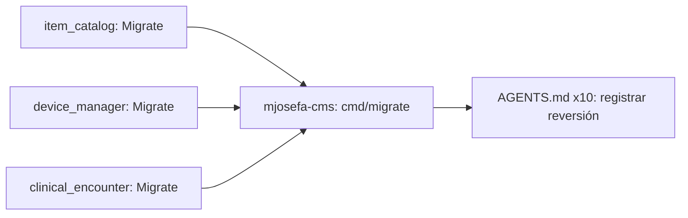

# MASTER_PLAN — el DDL sale de `New()`, vive en `Migrate()`, y corre desde `cmd/migrate/`

> Orquestador multi-repo. Cada módulo tiene su plan autocontenido en `docs/`.
> Despacho vía CodeJob workflow (skill: `agents-workflow`).
> Idioma: español para este índice; cada `docs/PLAN.md` de módulo está en
> inglés, como el resto del ecosistema (`CONSTRUCTION_HARNESS.md`).
> Origen: `veltylabs/mjosefa-cms` no arrancaba (`DOTENV_VISIBILITY_MASTER_PLAN.md`,
> ya resuelto) — al investigar el log `ENABLE_SCHEMA_SYNC not set to "true"…`
> para hacerlo más claro para un junior, apareció un problema más de fondo:
> el DDL de creación de tablas corre disperso, sin control, en cada arranque
> del servidor, en 3+ repos distintos, sin una única forma de hacerlo.

## 0. Qué encontré (verificado en código, no supuesto)

**Lo que ya está bien** — `webtyp.com/auth/authority` y `webtyp.com/rbac` ya
tienen el patrón correcto: una función `Migrate(conn ddl.Execer, ddlCompiler
ddl.Compiler) error`, **deliberadamente no llamada por `New()`**, documentada
como trabajo de deploy-time. Es el modelo que este plan generaliza.

**Lo que está mal, y por qué es una decisión cerrada que hay que reabrir** —
`veltylabs/modules/AGENTS.md` (canónico, copiado en cada uno de los 10 repos
de `veltylabs/modules/*`) documenta hoy, como el patrón **correcto y de
referencia**, llamar `ddl.New(...).CreateTable(m)` dentro de `New()`:

```go
if ddlCompiler, ok := db.RawConn().(ddl.Compiler); ok {
    if err := ddl.New(db.RawConn(), ddlCompiler).CreateTable(&CatalogItem{}); err != nil {
        return nil, err
    }
}
```

Verificado que **8 de los 10 módulos** ya siguen este patrón al pie de la
letra: `item_catalog`, `device_manager`, `clinical_encounter`, `agent_switch`,
`business_calendar`, `appointment_booking`, `business_hours`, `editorial`. Los
otros 2 (`work_schedule`, `provider_payouts`) tienen modelos pero **todavía
no** llaman a `ddl` en ningún lado (persistencia sin terminar). `REUSABLE_
MODULES_MASTER_PLAN.md` (§2, "El patrón") referencia esta misma forma como
cerrada — este plan **reabre y revierte** esa decisión, con justificación
explícita abajo, no por accidente ni por gusto.

**Por qué importa (evidencia, no especulación):**
1. **`CreateTable` es aditivo y seguro** — verificado en el compilador de
   Postgres (`translate.go:191`): emite `CREATE TABLE IF NOT EXISTS`, nunca
   altera ni borra. El riesgo real no es que `CreateTable` corra en cada
   arranque — es que **8 repos deciden esto cada uno por su cuenta**, sin una
   sola función a la que apuntar, sin forma de ejecutarlo aparte de arrancar
   el servidor completo, y sin paridad con cómo ya lo resuelven `auth`/`rbac`.
2. **Fuga confirmada hacia WASM — y no basta con corregir `backend.go`.**
   `mjosefa-cms/modules/{item_catalog,device_manager,clinical_encounter}/
   backend.go` no llevan `//go:build !wasm` (la convención de
   `project-layout` lo exige), pero eso es solo la mitad del problema:
   `view.go` de esos mismos tres módulos (código **neutro**, sí se compila a
   wasm) importa el paquete raíz del módulo de dominio
   (`itemcatalog.NewView(caller)`, `devicemanager.NewView(caller)`,
   `clinicalencounter...`) — así que aunque `backend.go` quede `!wasm`, el
   paquete raíz sigue enlazado en el binario wasm por el camino de la vista.
   Si `Migrate`/`ddl` viven en ese mismo paquete raíz (como en la versión
   anterior de este plan), `webtyp.com/ddl` viaja igual al cliente. **La
   corrección real es sacar `Migrate` a un subpaquete `migrate/` propio**
   que nada en el camino de wasm (`view.go`, `init.go`, el `backend.go` ya
   corregido) importa jamás — así `webtyp.com/ddl` nunca entra al grafo de
   compilación del cliente, sin depender de que cada consumidor recuerde
   poner el build tag correcto en el lugar correcto.
3. **`Sync()` (no `CreateTable`) ya causó un incidente real** contra
   producción: una migración corrida a mano intentó `ALTER` las tablas
   `device` (23 filas) y `session` (3 filas) contra el esquema legacy real
   (`id_device`, `id_session`, ~42k pacientes) y abortó a mitad de
   transacción — Postgres hizo rollback limpio, nada se perdió, pero
   confirma que no hay hoy ningún control sobre cuándo/cómo se ejecuta DDL
   destructivo contra la base viva.
4. **El nombre `ENABLE_SCHEMA_SYNC` miente** — hoy sólo decide si `cfg.OpenDB`
   abre una conexión real; el `CreateTable` de los módulos viaja como efecto
   secundario inevitable de esa conexión, no como algo que el flag controle
   por sí mismo. De ahí el mensaje confuso que un junior no puede accionar.

**Fuera de alcance, a propósito** — la rama abandonada
`feat/migrate-to-item-catalog-…` (pre-rebrand, `github.com/tinywasm/*`) no
contiene ninguna fusión de datos real entre `device_manager`/
`clinical_encounter` e `item_catalog` — sólo borraba su wiring de
`modules/init.go`. Las tres formas de tabla (`catalog_item`: sku/price/
currency; `device`: ip/location; `medical_history`: patient_id/diagnostic)
no comparten campos con sentido de dominio entre sí. **Este plan NO fusiona
ni consolida esos módulos** — cada uno migra su propio esquema, de forma
independiente, exactamente igual que los demás. Si en el futuro se decide
retirar o fusionar alguno, es una decisión de producto con su propio plan;
no se toca aquí.

## 1. El patrón nuevo (lo que reemplaza a §2 de `REUSABLE_MODULES_MASTER_PLAN.md`)

Cada módulo gana un **subpaquete** `migrate/` (no un archivo más en el
paquete raíz) — `<repo>/migrate/migrate.go`, `package migrate`:

```go
package migrate

import (
	"webtyp.com/ddl"

	itemcatalog "github.com/veltylabs/item_catalog"
)

// Migrate reconciles the database schema item_catalog owns: <Models>.
//
// It is deliberately NOT called by New, and deliberately lives in its own
// package — nothing on the WASM build path (view.go, init.go) ever imports
// "github.com/veltylabs/item_catalog/migrate", so webtyp.com/ddl never
// enters that build graph. Call this once from a migration binary, then let
// New assume the schema exists.
func Migrate(conn ddl.Execer, ddlCompiler ddl.Compiler) error {
	d := ddl.New(conn, ddlCompiler)
	if err := d.CreateTable(&itemcatalog.Model1{}); err != nil {
		return err
	}
	// ... one CreateTable per model this module owns, in FK dependency order
	return nil
}
```

`New()` (paquete raíz) pierde el bloque `ddl`/type-assert por completo —
pasa a asumir que el esquema ya existe, igual que `authority.New`/
`rbac.New` hoy — y con eso, el paquete raíz deja de importar
`webtyp.com/ddl` en absoluto. `migrate/migrate.go` importa el paquete raíz
(para nombrar los modelos), nunca al revés — sin ciclos.

Como cinco módulos comparten el mismo nombre de paquete (`migrate`),
`cmd/migrate` de la app consumidora importa cada uno con alias:
`itemcatalogmigrate "github.com/veltylabs/item_catalog/migrate"`, etc. — ver
`mjosefa-cms/docs/PLAN.md`.

## 2. `veltylabs/modules/AGENTS.md` — el bloque "Persistence" a reemplazar

Cada uno de los 10 módulos lleva su propia copia de este archivo (no hay un
único repo canónico — el propio `AGENTS.md` dice "cada módulo gana su propia
copia… si una regla resulta estar mal, el fix va aquí y se replica hacia
afuera"). El bloque "Persistence" actual (línea ~158) se reemplaza, en las 10
copias, por:

```markdown
- **Persistence**: `New(db *orm.DB, deps Deps)` receives an already-connected
  `*orm.DB` and assumes its schema already exists — it never creates or
  alters tables, and never imports `webtyp.com/ddl`. Schema reconciliation
  lives in its own **subpackage**, `<module>/migrate` (`package migrate`),
  exporting `Migrate(conn ddl.Execer, ddlCompiler ddl.Compiler) error`.
  Deliberately not called by `New`, and deliberately not in the module's
  root package: schema work is deploy-time work, run once from a migration
  binary (`cmd/migrate` in the composition-root app) — and keeping it in a
  separate package means nothing on a WASM build's import path (`view.go`,
  `init.go`, the root package itself) ever pulls `webtyp.com/ddl` into that
  binary, regardless of build tags.
  ```go
  // migrate/migrate.go
  package migrate

  import (
      "webtyp.com/ddl"

      thismodule "github.com/veltylabs/<this-module>"
  )

  func Migrate(conn ddl.Execer, ddlCompiler ddl.Compiler) error {
      d := ddl.New(conn, ddlCompiler)
      if err := d.CreateTable(&thismodule.CatalogItem{}); err != nil {
          return err
      }
      return nil
  }
  ```
  A module's own tests build `*orm.DB` over `storage/mem`
  (`orm.New(mem.New())`), which creates tables lazily on first `Exec` — they
  never call `Migrate`, and `New` never needs to type-assert for
  `ddl.Compiler` at all anymore.
```

Este mismo bloque va, verbatim, en el `docs/PLAN.md` de cada módulo (regla de
plan-authoring: el agente ejecutor solo tiene su propio repo).

## 3. Los 10 módulos — estado y orden de despacho

| # | Módulo | ¿Ya llama `ddl`? | Plan | Prioridad |
|---|---|---|---|---|
| 1 | `item_catalog` | Sí (Specialty, CatalogItem, Agreement) | [`docs/PLAN.md`](veltylabs/item_catalog/docs/PLAN.md) | **Alta — mjosefa-cms lo usa hoy** |
| 2 | `device_manager` | Sí (Device) | [`docs/PLAN.md`](veltylabs/device_manager/docs/PLAN.md) | **Alta — mjosefa-cms lo usa hoy** |
| 3 | `clinical_encounter` | Sí (MedicalHistory) | [`docs/PLAN.md`](veltylabs/clinical_encounter/docs/PLAN.md) | **Alta — mjosefa-cms lo usa hoy** |
| 4 | `agent_switch` | Sí (AgentSwitch) | misma receta que #1, aplicada a `mcp.go` | Baja — no importado por mjosefa-cms aún |
| 5 | `business_calendar` | Sí (BusinessHours, Holiday, Closure) | misma receta, `module.go` | Baja |
| 6 | `appointment_booking` | Sí (ver `repository.go`, itera un slice de modelos) | misma receta, `repository.go` | Baja |
| 7 | `business_hours` | Sí (BusinessHours) | misma receta, `mcp.go` | Baja |
| 8 | `editorial` | Sí (Post, PostTransition, Publication) | misma receta, `editorial.go` | Baja |
| 9 | `work_schedule` | No — persistencia sin terminar | al terminar su capa de persistencia, nace ya con `Migrate()`, nunca con `CreateTable` en `New()` | — |
| 10 | `provider_payouts` | No — persistencia sin terminar | ídem #9 | — |

Los módulos 4–8 quedan con la receta exacta documentada (§1+§2 arriba) para
cuando se importen a `mjosefa-cms` u otra app — no bloquean nada hoy. Los
módulos 1–3 son los únicos que bloquean a `mjosefa-cms`.

## 4. `mjosefa-cms` — el consumidor

[`docs/PLAN.md`](veltylabs/mjosefa-cms/docs/PLAN.md)
— gana `cmd/migrate/main.go` (llama `authority.Migrate` + `rbac.Migrate` +
`item_catalog.Migrate` + `device_manager.Migrate` + `clinical_encounter.
Migrate`, en ese orden), corrige los 3 `backend.go` (`//go:build !wasm`), y
renombra `ENABLE_SCHEMA_SYNC` → `ENABLE_DATABASE` con un mensaje que le dice
a un junior exactamente qué comando correr.

## 5. `REUSABLE_MODULES_MASTER_PLAN.md` — registrar la reversión

Una vez despachados 1–3, añadir una fila a su §3 "Decisiones cerradas":
> `ddl.CreateTable` dentro de `New()` (patrón original de esta ola) se
> revirtió en `DDL_MIGRATE_ISOLATION_MASTER_PLAN.md` — cada módulo gana
> `Migrate()` separado; `New()` asume el esquema. Motivo: fuga a wasm +
> ejecución sin control contra producción, ver ese plan para el detalle.

No se toca la tabla de fases A–I de ese documento — es una ola distinta, ya
cerrada, sobre otro problema (superficie de API/router).

## 6. Grafo de dependencias



- **Gate real:** `mjosefa-cms` Stage B (`cmd/migrate`) espera los 3 tags
  publicados de `item_catalog`/`device_manager`/`clinical_encounter`.
- Los módulos 4–10 y la nota en `REUSABLE_MODULES_MASTER_PLAN.md` son
  independientes, sin gate, se despachan cuando convenga.

## 7. Qué NO cambia

- `config/auth.go`'s `ProductionDeps` — no llama `Migrate` hoy, no la
  necesita llamar; sigue asumiendo que el schema de auth/rbac existe (ahora
  es responsabilidad de `cmd/migrate`, no cambia el archivo).
- No se toca ninguna fila de datos, en ningún ambiente. `CreateTable` (lo que
  corría hasta hoy) nunca alteró nada — este plan solo mueve *dónde* se
  invoca, no cambia lo que hace.
- No se fusiona ni se retira `device_manager`/`clinical_encounter` — ver §0.
