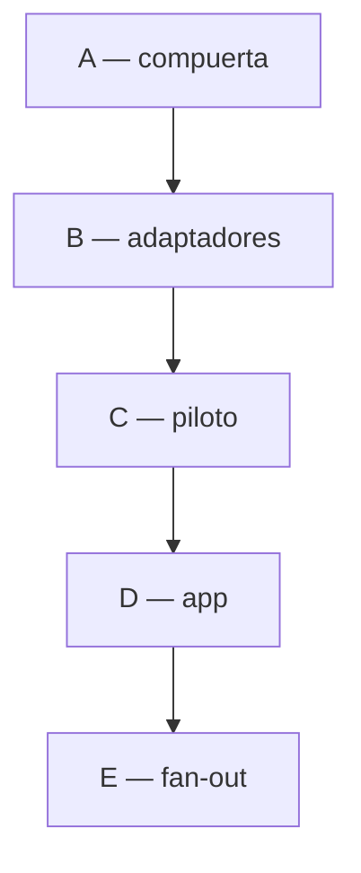
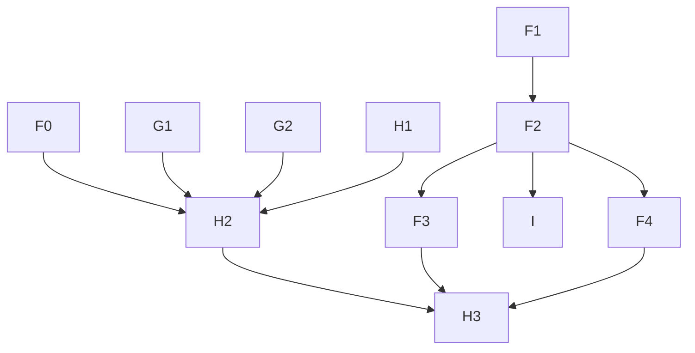

# MASTER PLAN — Módulos reutilizables: acoplados solo a contratos tipados

Hub multi-repo. Cierra el acoplamiento que impedía reutilizar y testear un módulo de dominio: dependían de implementaciones concretas (`mcp`, `json`, `unixid`) y no declaraban su vista. Detalle normativo (whitelist, stdlib, no-map/no-reflect, `storage/mem`): [`veltylabs/modules/AGENTS.md`](https://github.com/veltylabs/modules/blob/main/AGENTS.md) (canónico). Aquí solo estado, orden y decisiones cerradas.

> Dispatch: 2026-07-15 · Última consolidación: **2026-08-27** (ola F–I en curso, ver §5). Anterior: 2026-08-26
> Doctrina: [`CONSTRUCTION_HARNESS.md`](CONSTRUCTION_HARNESS.md)

---

## 1. Estado por pieza

| Fase | Repo | Qué | ¿Rompe API? | Estado |
|---|---|---|---|---|
| A1 | `model` | `IDGenerator{NewID()}` | No | ✅ `v0.0.15` |
| A2 | `router` | `Route.Accepts` + `Context.Decode/Encode` (`v0.1.12`), `Caller.Call` tipado (`v0.1.13`), `OpRegistry`/`OpModule` (`v0.1.14`) | Sí | ✅ `v0.1.14` |
| A3 | `view` | `Presenter` + `view.New(...)` + `mock` + `conformance` | N/A | ✅ `v0.1.0` |
| A4 | `events` | `Publisher`/`Subscriber`/`Broker`/`Event` | N/A | ✅ `v0.0.2` |
| B1 | `mcp` | `HarvestOps(...OpModule)`, `Caller` tipado | Sí | ✅ `v0.2.0` |
| B2 | `server` | httpd: `Context.Decode/Encode`; cae `/op` | No | ✅ `v0.2.32` |
| B3 | `unixid` | `GetNewID` → `NewID()` | Sí | ✅ `v0.2.24` |
| B4 | `layout` | `crudview` solo renderer | Sí | ✅ `v0.0.14` |
| B5 | `sse` | `sse.Publisher` ✅ `v0.1.1`; resta `Subscriber` wasm + `Fanout` | No | 🟡 mitad |
| B6a | `user` | Fix drift `orm v0.11` | No | ✅ `v0.0.37` (2026-07-18) |
| B6b | `user` | `Config.IDs`/`Events`, `MountOps`, `NewView(caller)` | Sí | ☐ listo para dispatch |
| C | `item_catalog` | Piloto `OpModule` + `view.New` | Sí | ✅ `c6f90d0` (drift `view v0.1.2` pendiente en su `PLAN.md`) |
| D | `mjosefa-cms` | Composition root | Consumidor | 🟡 PR #3; borrar `replace` y pinear `user v0.0.37` |
| E | 6 módulos | Réplica patrón C | Sí | 🟡 gated hasta C+D verdes |

**Ola F–I — estado hoy (detalle en §5.7):**

| Fase | Repo | Estado hoy |
|---|---|---|
| F1 | `tinywasm/model` | ✅ `v0.1.7` `PolicyDescriber`/`RolesFor` (2026-08-26) |
| F2 | `tinywasm/router` | ✅ `v0.1.29` `{id}` + `MountIntrospection` (2026-08-27) |
| F3 | `tinywasm/cloudflare` | ✅ `v0.0.12` `Param` edge (2026-08-27) — corrección `conformanceCtx.SetParams` |
| F4 | `tinywasm/server` | ✅ `v0.2.43` `Param` httpd + `MountIntrospection` (2026-08-27) |
| G1 | `veltylabs/site_manager` | ✅ `v0.4.1` scoping + `Accepts` (2026-08-27) |
| G2 | `veltylabs/site_content` | ✅ `v0.2.3` scoping + `MemberChecker` (2026-08-27) |
| H1 | `veltylabs/iam` | ✅ `v0.0.21` `Consumer`/`AssignRole` (2026-08-27) |
| F0 | `veltylabs/misitio` | ☐ **siguiente** — los seis 403 |
| H2 | `veltylabs/misitio` | ☐ bloqueado hasta F0+G1+G2+H1 |
| H3 | `veltylabs/misitio` | ☐ bloqueado hasta H2+F3+F4 |
| I | `tinywasm/apiexplorer` | ☐ bloqueado hasta F2 + crear repo |

## 2. El patrón

Módulo importa contratos (`model`, `router`, `view`, `events`, `orm`/`storage`/`ddl`) y recibe inyectado lo concreto (IDs, codec, renderer, broker, storage). Whitelist en `AGENTS.md`. `ddl.Compiler` es capacidad opcional del backend (SQL sí, `mem` no — `RawConn()` type-assert, no-op legítimo solo en tests).

## 3. Decisiones cerradas

- Aguas arriba, nunca fork local (`internal`/`replace`/interfaz local). Violaciones: `work_schedule` (`replace mcp`) y forks `mjosefa-cms` (cierra B6a).
- Vista en el módulo (`view.Presenter`); `layout` nunca es contrato. Ni `mcpd` ni partir `mcp`.
- App integra al final, una pasada.
- `AGENTS.md` canónico por módulo (2026-07-17).
- `clinical_encounterOld` no se toca.
- `ddl.CreateTable` dentro de `New()` (patrón original de esta ola) se revirtió en `DDL_MIGRATE_ISOLATION_MASTER_PLAN.md` — cada módulo gana `Migrate()` separado en su propio subpaquete `migrate/`; `New()` asume el esquema. Motivo: fuga de `webtyp.com/ddl` al binario wasm vía el import de la vista + ejecución de DDL sin control contra producción (ver ese plan para el detalle).

## 4. Grafo

Gate E cerrado hasta C+D verdes (verificado 2026-08-26: ambos `go build ./...` limpios — drifts resueltos, ola F–I puede despachar).

Criterio verde C: blacklist vacía (`tinywasm/mcp|json|unixid|sqlite|sqlt|postgres|layout`), `var _ router.OpModule = (*Module)(nil)`, `view.New`, `Deps{IDs,Publisher}`, `ddl`, `gotest` wasm+stdlib.

---

## 5. Ola F–I (2026-08-26) — superficie de API introspectable

**Hallazgo:** `misitio` tiene 11 rutas: 2 públicas, 3 `velty_admin`, **6 exigen permiso que ningún rol tiene → 403 permanente para todos**. Política solo concede `velty_admin → access_request:ru` + `site:c`. Causa: `model.Authorizer` es cierre (`¿puede X?`), ningún tipo responde `¿quién puede?` → `PolicyDescriber`/`RolesFor` en `model`.

**Duplicación saldada (resumen):** `ResourceSite` literales → `ResourceOf`, `hasPermission` → `AnyGrant`, `authctx`+`iamauth`+`authzcache` → `iam/client`, `api/config/routes` 3 copias de nombres → `config` hoja, `MeResponse` duplicado → uno en `config`, `unixid.NewUnixID()×6` → `config.New`.

**Worker no existe:** `edge.wasm` 662 KB (tope 1 MB). Tres puentes no-interfaz lo inflan 18 KB; la frontera real es el paquete: `routes` solo contrato (handlers+DTOs+`Presenter`), renderers en `modules/panel/` que `routes` nunca importa.

**Decisiones ola:**
- `PolicyDescriber` en `model` (no librería nueva).
- Sintaxis `{id}` (ServeMux Go1.22); `:id` sería literal; `{id...}` se rechaza.
- `misitio` conserva REST; `.Accepts(&Args{})` por ruta para el explorer; `view.Presenter` diferido.
- Chequeo por fila en handler (multi-tenant canónico); `.Authenticated()` reservado para `me`.

**Hueco seguridad G1/G2:** `site_manager`/`site_content` ops no filtraban por pertenencia — `Eq(Id)` a secas es cross-tenant. Cerrado en G1/G2 antes de montar ops.

### 5.7 Fases y puertas

| Fase | Repo | Plan | Qué | Puerta | Estado |
|---|---|---|---|---|---|
| F0 | `veltylabs/misitio` | [`PLAN_ACCESO_403.md`](https://github.com/veltylabs/misitio/blob/main/docs/PLAN_ACCESO_403.md) | 6×403 `PolicyDescriber`+`ResourceOf` | — | ☐ **despachable** |
| F1 | `tinywasm/model` | `docs/PLAN.md` | `RoleGrant`/`PolicyDescriber`/`RolesFor` | — | ✅ `v0.1.7` |
| F2 | `tinywasm/router` | `docs/PLAN.md` | `{id}`+`Param`+`MountIntrospection`+`Args` | F1 | ✅ `v0.1.29` |
| F3 | `tinywasm/cloudflare` | `docs/PLAN.md` | `Param` edge; borra `pathMatches` | F2 | ✅ `v0.0.12` |
| F4 | `tinywasm/server` | `docs/PLAN.md` | `Param` httpd + `MountIntrospection` + `Config.Policy` | F2 | ✅ `v0.2.43` |
| G1 | `veltylabs/site_manager` | `docs/PLAN.md` | scoping `MemberOf` + `Accepts` | — | ✅ `v0.4.1` |
| G2 | `veltylabs/site_content` | `docs/PLAN.md` | scoping `site_id` + `MemberChecker` | — | ✅ `v0.2.3` |
| H1 | `veltylabs/iam` | `docs/PLAN.md` | `Consumer`+`AssignRole` | — | ✅ `v0.0.21` |
| H2 | `veltylabs/misitio` | `PLAN_ARQUITECTURA_MODULOS.md` | `config` hoja + `modules/<m>/` planos | F0+G1+G2+H1 | ☐ bloqueado |
| H3 | `veltylabs/misitio` | `PLAN_RUTAS_PARAMETRIZADAS.md` | `/api/sites/{id}/content` `/_routes` | H2+F3+F4 | ☐ bloqueado |
| I | `tinywasm/apiexplorer` | `PLAN_APIEXPLORER_NEW_REPO.md` | tabla endpoints/roles + formulario | F2+crear repo | ☐ bloqueado |

**Puertas humanas:** 1) `gonew --owner tinywasm apiexplorer` + copiar plan a `docs/PLAN.md`. 2) Publicar librería antes de `go get <dep>@latest`; si símbolo falta, detenerse — jamás `replace` ni stub.

**Verificación cierre ola:** `curl -s https://misitio.velty.cl/_routes -H 'Cookie: iam_session=…' | jq` — toda ruta `guarded` con `policy_known:true` y `roles:[]` es muerta; al terminar debe estar vacío (`localhost:8080/_routes` hasta desplegar).
